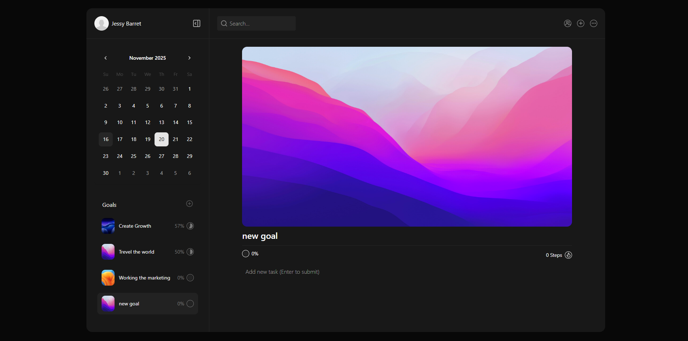

# todo_list_svelte

> [!WARNING]
> предпологается что все действия будут происходить из корня проекта

## Клонирование репозиторий

```cmd
git clone https://github.com/nais2008/toDo_list_svelte
cd toDo_list_svelte
```

## Установка зависимостей

```cmd
npm install
```

## Запуск проекта

```cmd
npm run dev
```

## Вид приложения


